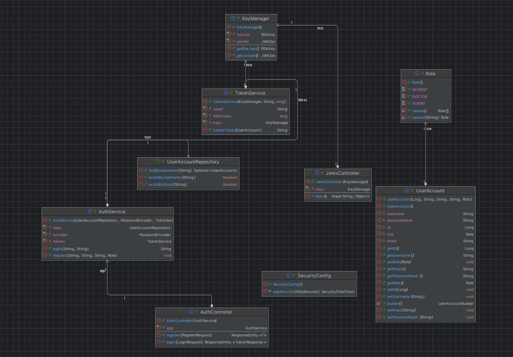
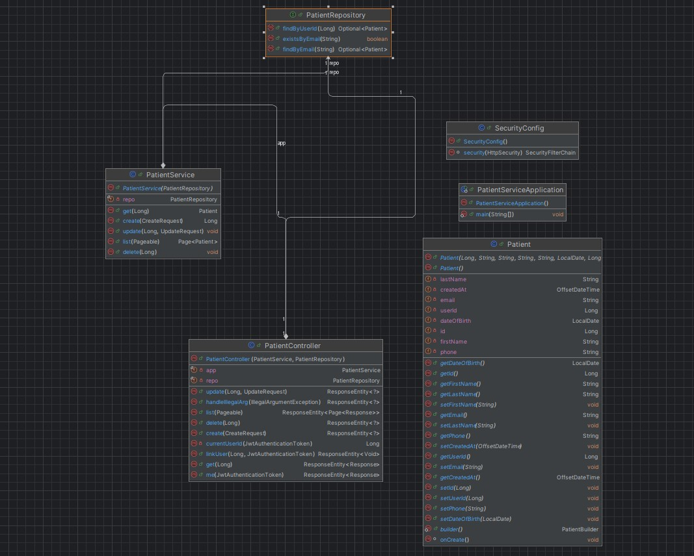
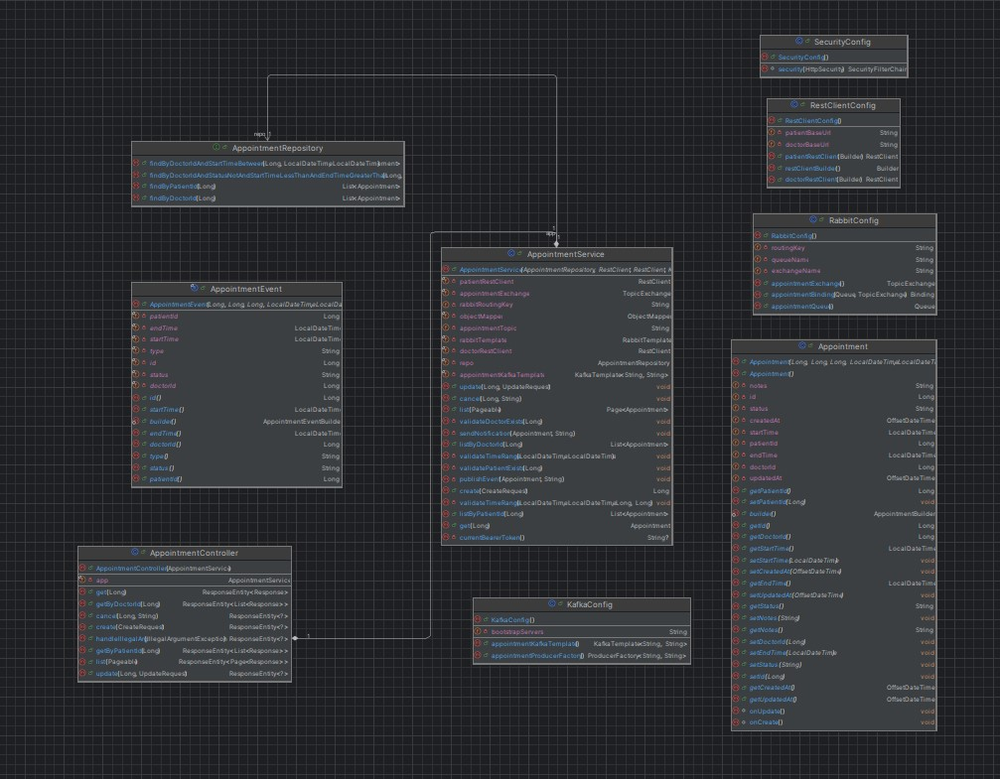
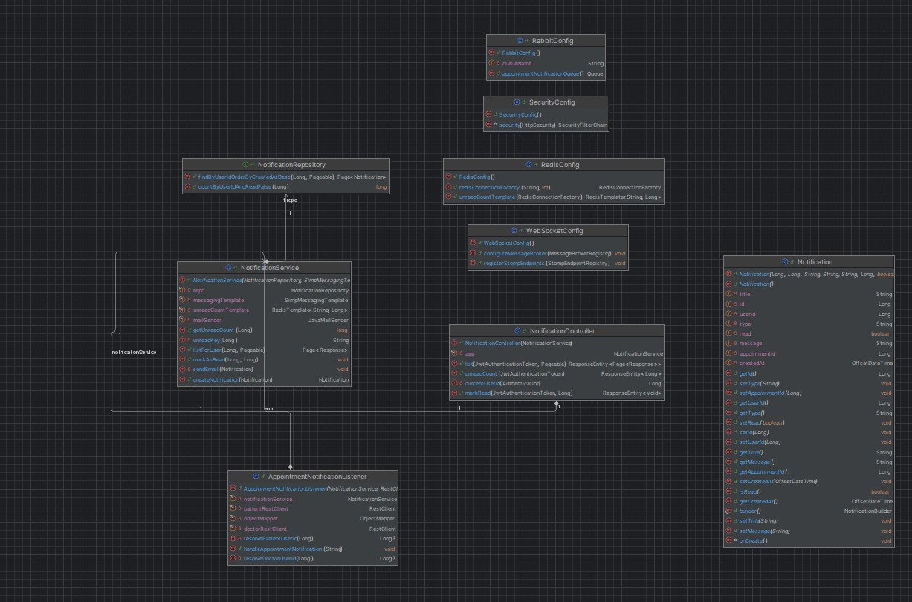
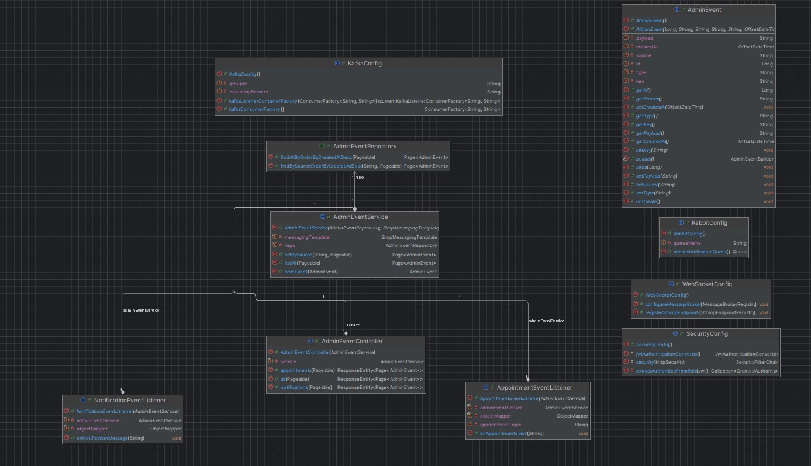

# Medical Appointment &amp; Consultation Platform

A Distributed Microservices System for Healthcare Scheduling, Real-Time Notifications and Event Auditing.

## 1. Overview

MedApp is a fully containerized, distributed system for managing medical appointments, real-time notifications, and audit/event logging, designed using service-oriented and microservice architecture principles.

The platform includes:

- Multiple Spring Boot microservices:
  - `auth-service`
  - `patient-service`
  - `doctor-service`
  - `appointment-service`
  - `notification-service`
  - `admin-events-service`
- A reverse proxy & load balancer built with **NGINX**
- Asynchronous messaging via **RabbitMQ**
- Event streaming via **Kafka**
- Real-time WebSocket notifications
- A micro-frontend architecture using **React + Vite**:
  - `auth-ui`
  - `patient-ui`
  - `doctor-ui`
  - `admin-ui`
- Fully dockerized environment using **Docker Compose**
- JWT-based authentication using an **Auth Service**

The application enables patients and doctors to manage appointments, receive live notifications, and provides administrators with a real-time event-monitoring dashboard.

---

## 2. High-Level Architecture

> The system architecture is based on microservices communicating over HTTP, Kafka, and RabbitMQ, proxied and secured via NGINX and JWT.

**Main components:**

- **Gateway Layer**

  - NGINX reverse proxy exposes a single public entrypoint (`localhost:4000`).
  - Routes HTTP requests to back-end services and front-end micro UIs.
  - Terminates WebSocket connections and forwards them to the corresponding services.

- **Business Microservices**

  - `auth-service`: Authentication & JWT issuing
  - `patient-service`: Patient profiles
  - `doctor-service`: Doctor profiles
  - `appointment-service`: Booking, updating, and canceling appointments
  - `notification-service`: User notifications (WebSocket + email)
  - `admin-events-service`: Centralized event auditing for Kafka & RabbitMQ

- **Data & Messaging Layer**

  - **PostgreSQL**: Primary relational database for most services.
  - **Redis**: In-memory data store for notification unread counts.
  - **RabbitMQ**: Message broker for notification-related events.
  - **Kafka**: Event streaming platform for appointment events and system auditing.
  - **Mailhog**: Development SMTP for email notifications.

- **Presentation Layer**
  - `auth-ui`: Login micro-frontend.
  - `patient-ui`: Patient portal.
  - `doctor-ui`: Doctor portal.
  - `admin-ui`: Admin panel with real-time events.

You can later add UML and C4 diagrams (system context, container, and component diagrams) exported from IntelliJ or other tooling.

---

## 3. Microservices

### 3.1 Auth Service (`auth-service`)

- **Responsibilities:**

  - User registration and login.
  - Issuing JWT access tokens signed with an RSA key pair (`RS256`).
  - Exposing a JWKS endpoint so other services can validate tokens.
  - Storing users and roles.

- **Endpoints:**
  - `POST /auth/register` — Register a new user account.
  - `POST /auth/login` — Accepts `username` and `password`, returns a response like:

```json
{
  "accessToken": "<JWT>",
  "tokenType": "Bearer"
}
```



### 3.2 Patient Service (`patient-service`)

- **Responsibilities:**

  - CRUD operations for patient profiles.
  - Link users from auth-service to patient entities.
  - Provide a way to discover the current patient based on the authenticated user.

- **Key technologies:**
  - Spring Boot 4
  - Spring Security OAuth2 Resource Server (JWT)
  - Spring Data JPA
  - PostgreSQL



### 3.3 Doctor Service (`doctor-service`)

- **Responsibilities:**
  - CRUD operations for doctors (name, specialty, etc.).
  - Link users to doctors.
  - Provide doctor discovery based on JWT-authenticated user.


### 3.4 Appointment Service (`appointment-service`)

- **Responsibilities:**

  - Appointment CRUD: create, update, cancel.
  - Validation: ensure patient and doctor exist (via REST calls); validate time ranges and overlapping appointments.
  - Event publishing: publish Kafka events to appointment-events topic and publish RabbitMQ messages for user notifications.

- **Key technologies:**
  - Spring Boot 4 (Web, Security, Data JPA)
  - RestClient for service-to-service HTTP calls
  - Kafka (spring-kafka)
  - RabbitMQ (spring-amqp)
  - PostgreSQL



### 3.5 Notification Service (`notification-service`)

- **Responsibilities:**

  - Listen to RabbitMQ messages regarding appointment changes.
  - Create notification entities (per user).
  - Maintain unread notification counters in Redis.
  - Send WebSocket notifications to currently connected clients.
  - Send email notifications using Mailhog.

- **Key technologies:**

  - Spring Boot 4
  - Spring WebSocket + STOMP
  - Spring Data JPA
  - Redis
  - Spring AMQP (RabbitMQ)
  - Mailhog (SMTP)



### 3.6 Admin Events Service (`admin-events-service`)

- **Responsibilities:**

  - Consume Kafka appointment events.
  - Consume RabbitMQ notification events.
  - Store all events as AdminEvent entities.
  - Provide paginated REST endpoints for admin monitoring.
  - Broadcast real-time events via WebSocket to be consumed by admin-ui.

- **Key technologies:**
  - Spring Boot 4
  - Spring Data JPA
  - Spring Kafka
  - Spring AMQP (RabbitMQ)
  - Spring WebSocket + STOMP
  - PostgreSQL



## 4. NGINX Gateway

NGINX acts as the single entry point to the system and routes both REST and WebSocket traffic.

## 5. Deployment & Setup

### Built-in Docker Load Balancing:

The appointment service is deployed with multiple replicas, and Docker's internal service discovery (DNS-based round-robin load balancing) automatically distributes requests among them. E.g. When Nginx makes a request to appointment-service:8083, Docker dynamically routes it to one of the available replicas.

**The docker-compose.yml orchestrates:**

- auth-service
- patient-service
- doctor-service
- appointment-service
- notification-service
- admin-events-service
- postgres
- redis
- rabbitmq
- zookeeper + kafka + kafka-init (topic creation)
- mailhog
- nginx

- React frontends (auth-ui, patient-ui, doctor-ui, admin-ui)

**Build backend services:**

```bash
cd services/auth-service (repeat for other services)
./mvnw clean package -DskipTests
```

To start the entire system, run:

```bash
docker-compose build
docker-compose up -d
```

**Entrypoint: http://localhost:4000**

## Technologies Used

**Backend**

- Spring Boot 4
- Spring Security + OAuth2 Resource Server
- RabbitMQ
- Kafka
- PostgreSQL
- Redis
- Mailhog (SMTP)
- STOMP over WebSockets (SockJS)

**Frontend**

- React
- STOMP/SockJS client
- Micro-frontend isolation via NGINX routes

**Deployment**

- Docker Compose
- NGINX Reverse Proxy
- Docker networks for inter-service communication
